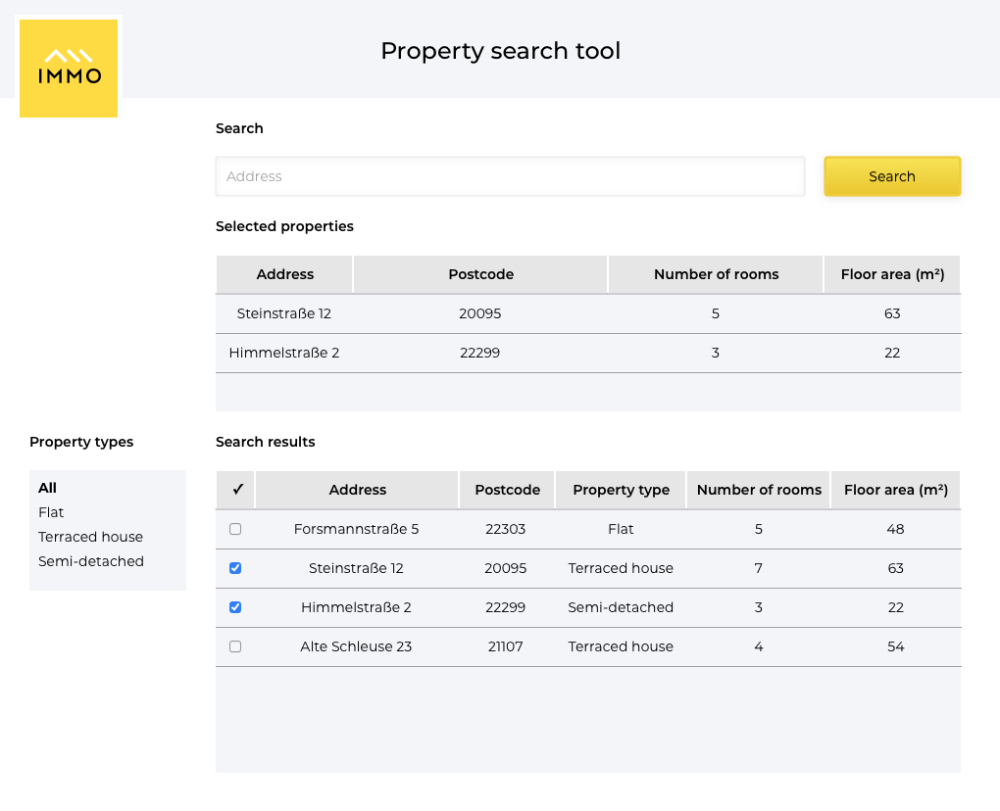

# IMMO Take-Home App/ Test

## About:

React-typescript takehome app (with a touch of Bootstrap and vanilla css for styling).

Time spent: roughly 3 hours.

## To run:

Clone the repo and from a terminal within the app root folder, enter:

```
npm install
```

then:

```
npm start
```

App will be viewable on http://localhost:3000

# Challenge Brief:

For this exercise, you're going to implement a web page according to the
attached design (see below)). The purpose of the page is to allow users to search for
properties matching a given address search-string, and select some of the
resulting records to appear in the "Selected properties" section at the top of
the page.



## User journey

- The user should be able to enter an address (or address fragment) in the
  address search field, and the search-results should update with the results of
  the provided "API" module upon pressing the "Search" button.
- The sidebar can be used to further filter the results by property type. A list
  of all available property types can be retrieved from the `api.js` module
  using `getAvailablePropertyTypes`.
- Property records should appear in the "Selected properties" section if the
  corresponding checkbox in the search-results table is checked.
- Changing the property-type filter or address search-string should not have any
  effect on the selected properties.

## API

The `api.js` module exposes three endpoints:

- `fetchProperties` takes an object with an `address` string and an optional
  `propertyType` string. If provided, the `propertyType` should be the `value` of
  one of the objects returned by `getAvailablePropertyTypes`. The function will
  return a `Promise` wrapping an object with the following shape:

  ```js
  { properties: [PropertiesListEntry, ...] }
  ```

  where each `PropertiesListEntry` contains these attributes:

  - `id`
  - `address`
  - `postcode`
  - `propertyType`

  This endpoint will take up to 0.5s to complete.

- `fetchPropertyDetails` takes a property ID and will return a
  `Promise` wrapping an object of the following shape:

  ```js
  {
    property: PropertyDetails;
  }
  ```

  where each `PropertyDetails` object contains these attributes:

  - `id`
  - `address`
  - `postcode`
  - `propertyType`
  - `numberOfRooms`
  - `floorArea`

  This endpoint will also take up to 0.5s to complete.

- `getAvailablePropertyTypes` will return a collection of all property
  types available to filter by. It returns a `Promise` wrapping an object
  with the following shape:

  ```js
  {
    propertyTypes: [PropertyType];
  }
  ```

  where each `PropertyType` object contains these attributes:

  - `label`
  - `value`

Keep in mind that it is always possible for unexpected errors to appear when
working with external APIs.

Please import the API module unmodified in your completed solution.

## Responsive design

In this hypothetical scenario, there was no time to create a dedicated design
for small screens, but we expect a portion of the users to be on a phone. It's
up to you to come up with a responsive implementation of the design.
